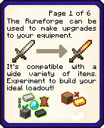
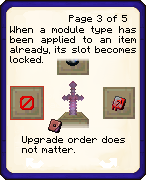
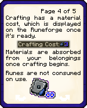
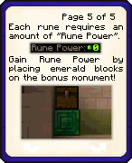

# Translating Book Pages

This guide shows each book page image and provides a line for the translated text found within each image. Replace the example translations with your own.

---

## 1. `base.png`

**Translation:**  
5쪽중 1쪽
룬 제련소는 무기와 도구를 개조하는 데 사용됩니다.
다양한 아이템과 재료와 호환이 됩니다. 시행착오를 통해 좋은 무구를 만드세요!

---

## 2. `placement.png`

**Translation:**  
5쪽중 2쪽
업그레이드
접두사 접미사
룬을 배치하려면 액자에
( [ 자리는 고정!!!! )

---

## 3. `order.png`

**Translation:**  
5쪽중 3쪽
해당하는 종류의 룬이 이미 적용된 경우, 해당 슬롯이 잠깁니다.
개조 순서는 상관없습니다.

---

## 4. `materials.png`

**Translation:**  
5쪽중 4쪽
제작 시 비용이 정산되며, 이는 룬 제련소에 표시됩니다.

버튼을 눌러서 제작 시 자동으로 인벤토리에서 정산됩니다.
룬은 소모품이 아니며 무한히 사용 가능합니다.

---

## 5. `power.png`

**Translation:**  
5쪽중 5쪽
각 룬은 일정량의 "룬의 힘"을 필요로 합니다.

보너스 기념물에 에메랄드 블록을 배치함으로써 룬의 힘을 증대시키세요!

---
