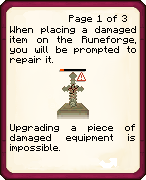
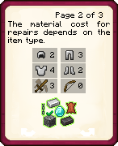

# Translating Book Pages

This guide shows each book page image and provides a line for the translated text found within each image. Replace the example translations with your own.

---

## 1. `repair.png`

**Translation:**  
3쪽중 1쪽
손상된 아이템을 룬 제련소에 배치할 경우, 수리를 할 수 있게 됩니다.
손상된 장비를 개조할 수는 없습니다.

---

## 2. `cost.png`

**Translation:**  
3쪽중 2쪽
수리에 필요한 재료의 개수는 아이템의 종류에 따라 다릅니다.

---

## 3. `xp.png`

**Translation:**  
3쪽중 3쪽
추가적으로, 아이템의 개조 비용의 총합에 비례하는 양만큼의 경험치를 요구합니다.

수리 시, 현재 경험치가 핫바 위에 표시됩니다.

---
