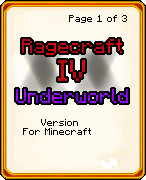
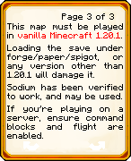
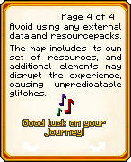

# Translating Book Pages

This guide shows each book page image and provides a line for the translated text found within each image. Replace the example translations with your own.

---

## 1. `title.png`

**Translation:**  
4쪽중 1쪽
지저세계
버전
마인크래프트 버전
( 위치 유지!!!!! )
(보라색 글자 바꿀수 있다면 바꾸고 아닐 경우 냅두기)

---

## 2. `settings.png`

**Translation:**  
4쪽중 2쪽
필수 설정:
렌더 / 시뮬레이션 거리: 청크 10+개
입자: 모두
대부분의 필수 설정은 자동으로 설정됩니다.
게임 모드/규칙을 커맨드 또는 순간이동 등을 통해 바꿀 경우 해당 세이브를 손상시킬 수 있습니다.

---

## 3. `mods.png`

**Translation:**  
4쪽중 3쪽
이 맵은 반드시 바닐라 마인크래프트 1.20.1에서 플레이해야 합니다.
이 맵을 포지/페이퍼/스피곳이나 1.20.1이 아닌 다른 마인크래프트 버전으로 열었을 경우 손상이 일어날 것입니다.
소듐의 경우 작동함을 확인했으며, 사용될 수 있습니다.
서버에서 플레이할 경우, 반드시 enable-command-block 및 allow-flight가 true로 되어있는지 확인해 주세요.

---

## 4. `packs.png`

**Translation:**  
4쪽중 4쪽
외부 데이터팩/리소스팩 사용을 자제해 주세요.
이 맵은 자체적인 리소스를 사용하며, 추가 항목들은 경험을 망칠 수 있으며 비정상적인 버그를 발생시킬 수 있습니다.
좋은 경험이 되기를!

---
